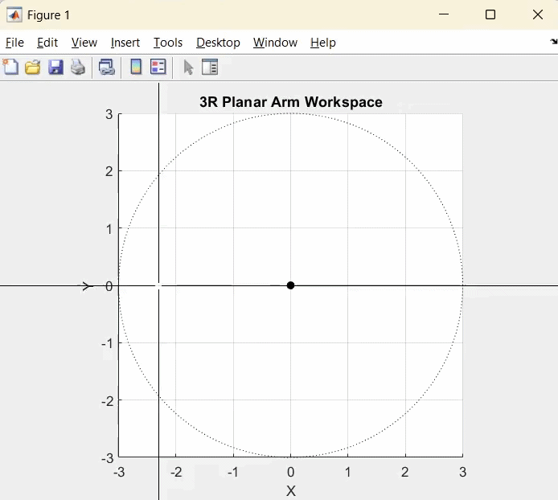

# Robot Arm Kinematics and Control

MATLAB simulation of a 3-DOF planar robot arm that tracks user-drawn trajectories using iterative inverse kinematics and computed-torque control.

---

---

## Overview

This project implements a complete task-space to joint-space control pipeline for a 3R planar manipulator. A user draws an arbitrary path in the workspace, which is smoothed and resampled into a time-parameterized trajectory. Joint angles are computed using an iterative damped least-squares inverse kinematics solver, and a PD computed-torque controller tracks the motion while compensating for gravity.

The system emphasizes smooth motion, numerical robustness, and dynamic consistency.

---

## Design Goals

- Convert arbitrary user-drawn paths into smooth trajectories  
- Maintain continuous joint motion without configuration flipping  
- Incorporate gravity compensation into control  
- Improve tracking accuracy beyond simple PD control  
- Visualize motion and quantify tracking error  

---

## Architecture

### 1. Workspace & Path Processing
- User inputs a freehand curve using `ginput()`
- Cubic spline interpolation smooths the path
- The spline is resampled into 400 uniformly spaced points
- Trajectory time is parameterized over 12 seconds

### 2. Forward Kinematics
Analytical FK is implemented using geometric relationships for a 3R planar arm:

- Joint positions computed incrementally
- End-effector position derived from cumulative rotations

### 3. Iterative Inverse Kinematics

Rather than using a closed-form solution, this implementation uses a damped least-squares Jacobian method:

- Previous joint configuration used as initialization
- Step size limited to avoid instability
- Damping term prevents singular behavior
- Workspace scaling ensures reachable targets

This approach eliminates joint flips and produces smooth motion across complex curves.

### 4. Control Strategy

A computed-torque style controller is implemented:

tau = Mqdd_des + Kpe + Kd*edot - tau_g

Where:
- `M` is a simplified joint-space inertia matrix
- `tau_g` is gravity torque
- `Kp`, `Kd` are joint gains
- Desired accelerations are feedforward

Joint viscous damping is included in the dynamic model:

Mqdd + Bqd = tau

This improves stability and reduces oscillation.

---

## Tracking Performance

- End-effector error is computed over time
- PD + feedforward acceleration significantly improves responsiveness
- Gravity compensation prevents sagging in extended configurations
- Smaller time steps and longer trajectory durations reduce peak error

Error is evaluated as the norm between desired and actual end-effector positions.

---

## How to Run

1. Open MATLAB.
2. Run the main script.
3. Click multiple times around the worspace and press Enter.
4. The robot will compute and track the trajectory.
5. Tracking error will be plotted automatically.

---

## Implementation Highlights

- Persistent IK initialization for smooth continuity  
- Damped least-squares Jacobian inverse  
- Step-size limiting for numerical stability  
- Workspace reach constraint enforcement  
- Explicit gravity torque modeling  
- Dynamic integration using forward Euler  

---

## Skills Demonstrated

- Nonlinear kinematics  
- Jacobian-based inverse kinematics  
- Numerical methods for robotics  
- Trajectory generation  
- Joint-space dynamic modeling  
- Nonlinear control implementation  
- MATLAB simulation & visualization  

---

## Future Improvements

- Replace simplified inertia model with full Lagrangian dynamics  
- Implement adaptive gain tuning  
- Add obstacle avoidance  
- Extend to 3D manipulator
- Improve UI

